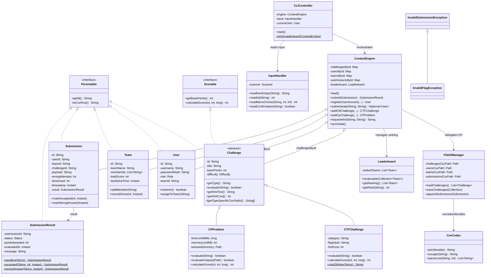

# Cyber-Algo Arena

**A Hybrid CTF + Competitive Programming Competition Engine with CSV Persistence**

---

## Table of Contents

1. [Project Overview & Problem Statement](#1-project-overview--problem-statement)
2. [Architecture & OOP Highlights](#2-architecture--oop-highlights)
3. [Class Diagram & Inheritance Hierarchy](#3-class-diagram--inheritance-hierarchy)
4. [Compilation & Execution Guide](#4-compilation--execution-guide)
5. [CSV Schema Contracts](#5-csv-schema-contracts)
6. [Project Structure](#6-project-structure)

---

## 1. Project Overview & Problem Statement

### The Problem

Traditional competitive programming platforms and Capture-The-Flag (CTF) platforms operate in isolation. CTF events focus on security-oriented flag retrieval across categories like cryptography, binary exploitation, and forensics, while Competitive Programming (CP) events center on algorithmic problem-solving with strict time and memory constraints. Organizers seeking a unified competition format are forced to stitch together incompatible tools, losing cohesive scoring, ranking, and audit capabilities.

### The Solution

**Cyber-Algo Arena** is a pure Java OOP contest engine that unifies both formats under a single architecture:

| Capability | CTF Mode | CP Mode |
|---|---|---|
| **Submission** | Raw flag → SHA-256 digest comparison | Candidate output directory → testcase diff |
| **Scoring** | `basePoints − (wrongAttempts × 10) − (hintsUsed × hintCost)` | `basePoints − (wrongAttempts × 10) − (elapsed / 10s)` |
| **Hints** | Paid per-use (point deduction) | Free & informational |
| **Validation** | Constant-time hash comparison | Whitespace-normalized token matching |

### Key Features

- **Role-based access** — Admin and Player dashboards with SHA-256 credential hashing.
- **Full challenge CRUD** — Admins dynamically add, update, and remove challenges at runtime.
- **Hint economy** — CTF hints carry explicit point costs; CP hints are free.
- **Team-scoped solve tracking** — A challenge solved by any team member locks it for the entire team.
- **Deterministic leaderboard** — Primary sort by score (desc), tiebreak by last-solve timestamp (asc), final tiebreak by team ID.
- **CSV persistence** — All state round-trips through RFC 4180-compliant CSV files. No external databases.
- **Audit log** — Every submission attempt is appended to `submissions.csv` with full metadata.
- **DemoRunner** — A standalone executable that simulates a complete contest lifecycle with 27 programmatic assertions.

---

## 2. Architecture & OOP Highlights

### Layered Architecture

```
┌──────────────────────────────────────────────────────┐
│                    Presentation                      │
│         App.java  ·  CLIController.java              │
│              InputHandler.java                       │
├──────────────────────────────────────────────────────┤
│                   Domain Logic                       │
│  ContestEngine.java  ·  Leaderboard.java             │
├──────────────────────────────────────────────────────┤
│                   Domain Model                       │
│  Challenge (abstract)                                │
│    ├── CTFChallenge    ├── CPProblem                  │
│  User  ·  Team  ·  Submission  ·  SubmissionResult   │
├──────────────────────────────────────────────────────┤
│                   Persistence                        │
│      FileIOManager.java  ·  CsvCodec.java            │
├──────────────────────────────────────────────────────┤
│                  Cross-Cutting                       │
│  Persistable  ·  Scorable  ·  Custom Exceptions      │
└──────────────────────────────────────────────────────┘
```

### OOP Principles in Action

#### Polymorphism

The `Challenge` abstract class defines the contract; subclasses diverge in behavior:

```java
// Challenge.java — abstract template
public abstract boolean evaluate(String submissionPayload) throws InvalidSubmissionException;
public abstract int calculateScore(int wrongAttempts, int hintsUsed, long elapsedMillis);

// CTFChallenge — SHA-256 digest comparison
public boolean evaluate(String submissionPayload) throws InvalidFlagException {
    String submittedHash = sha256Hex(submissionPayload);
    return MessageDigest.isEqual(flagHash.getBytes(), submittedHash.getBytes());
}

// CPProblem — file-based testcase diffing
public boolean evaluate(String submissionPayload) throws InvalidSubmissionException {
    return evaluateOutputs(Path.of(submissionPayload));
}
```

`ContestEngine.submit()` calls `challenge.evaluate(payload)` without knowing the concrete type — the JVM dispatches to the correct override at runtime.

#### Encapsulation

- **User** never stores plaintext passwords — only SHA-256 hashes via `CTFChallenge.sha256Hex()`.
- **CTFChallenge** stores only the flag hash; no `getFlag()` accessor exists by design.
- **Team** fields (`totalScore`, `lastSolveTime`) are mutated exclusively through `recordSolve()`.
- **Submission** result fields transition exactly once from `PENDING` via guarded `markAccepted()` / `markWrongAnswer()` / `markInvalid()` — repeat transitions throw `IllegalStateException`.

#### Interface-Driven Design

| Interface | Purpose | Implementors |
|---|---|---|
| `Persistable` | `getId()` + `toCsvRow()` — CSV serialization contract | `Challenge`, `User`, `Team`, `Submission`, `SubmissionResult` |
| `Scorable` | `getBasePoints()` + `calculateScore(wrong, hints, elapsed)` — scoring contract | `CTFChallenge`, `CPProblem` |

#### Custom Exception Hierarchy

```
RuntimeException
├── ChallengeNotFoundException      — challenge ID absent from registry
├── TeamNotFoundException           — team ID absent from registry
├── UserNotFoundException           — user ID absent from registry
├── DuplicateSubmissionException    — submission ID replayed
└── InvalidSubmissionException      — malformed or unacceptable submission
    └── InvalidFlagException        — CTF flag empty or malformed

Exception (checked)
└── CorruptedFileException          — CSV schema violation during load
```

Checked `CorruptedFileException` forces callers to handle data corruption explicitly. Runtime exceptions model domain invariant violations that indicate programming errors or invalid user actions.

#### Persistence Strategy

`FileIOManager` owns all CSV I/O through a generic `loadRecords()` / `saveRecords()` template method, parameterized by a `RowParser<T>` functional interface. `CsvCodec` handles RFC 4180 quoting, escaping, and parsing — no third-party CSV libraries needed.

Submissions use **append-only** writes via `appendSubmission()` for audit integrity, while challenges, users, and teams use **full rewrite** on mutation.

---

## 3. Class Diagram & Inheritance Hierarchy



### Inheritance Hierarchy (ASCII)

```
Persistable (interface)
├── Challenge (abstract, also implements Scorable)
│   ├── CTFChallenge (final) ── SHA-256 flag verification
│   └── CPProblem (final) ──── file-based testcase diffing
├── User (final) ────────────── role-based account
├── Team (final) ────────────── score aggregate
├── Submission (final) ──────── attempt record
└── SubmissionResult (final) ── evaluation outcome

Scorable (interface)
└── Challenge (abstract)
    ├── CTFChallenge ── penalty: wrongAttempts×10 + hintsUsed×hintCost
    └── CPProblem ───── penalty: wrongAttempts×10 + elapsed/10s

RuntimeException
├── ChallengeNotFoundException
├── TeamNotFoundException
├── UserNotFoundException
├── DuplicateSubmissionException
└── InvalidSubmissionException
    └── InvalidFlagException

Exception
└── CorruptedFileException
```

---

## 4. Compilation & Execution Guide

### Prerequisites

- **Java JDK 11+** (uses `Files.writeString`, `Path.of`, `String.repeat`)
- No external libraries, build tools, or frameworks required

### Step 1: Compile

```bash
cd /path/to/Hybrid
javac -d out src/*.java
```

All 24 source files compile to `out/` with zero warnings.

### Step 2a: Run — Interactive CLI Mode

```bash
java -cp out App
```

Or specify a custom data directory:

```bash
java -cp out App /path/to/custom_contest_data
```

**Interactive session flow:**

```
=== Cyber-Algo Arena ===
1. Register user
2. Login
0. Exit
Select option: _
```

After login, players see:

```
=== Player Dashboard: alice ===
1. View challenge catalog
2. View details / request hint
3. Submit solution
4. View leaderboard
0. Logout
```

Admins see:

```
=== Admin Dashboard: admin ===
1. Add CTF challenge
2. Add CP challenge
3. Update challenge points
4. Remove challenge
5. View submission logs
6. Force leaderboard refresh + CSV sync
0. Logout
```

### Step 2b: Run — DemoRunner Mode (Automated)

```bash
java -cp out DemoRunner
```

This runs a complete lifecycle simulation with no user input required:

1. Creates a clean `contest_data_demo/` directory
2. Registers 1 admin + 2 teams (2 players each)
3. Admin creates 1 CTF challenge + 1 CP problem
4. Simulates: wrong flag → hint request → correct flag → wrong CP → correct CP → duplicate rejection
5. Prints the final leaderboard
6. Reloads all CSV files into a fresh engine and asserts data consistency
7. Reports `27/27 assertions passed`

**Expected output (abbreviated):**

```
╔══════════════════════════════════════════════════╗
║       Cyber-Algo Arena — DemoRunner v1.0        ║
╚══════════════════════════════════════════════════╝

━━━ Phase 1: Registration ━━━
  ✓ Admin authenticates
  ✓ Alice authenticates
  ✓ Wrong password rejected

━━━ Phase 3: Submission Simulation ━━━
  ✓ Wrong flag → WRONG_ANSWER
  ✓ Hint usage tracked
  ✓ Correct flag → ACCEPTED
  ✓ Points awarded > 0
  ✓ Duplicate team solve rejected

━━━ Phase 4: Final Leaderboard ━━━
RANK   TEAM                     SOLVES   SCORE      LAST SOLVE
--------------------------------------------------------------------------
1      Alpha Squad              1        165        2026-08-15T10:47:14Z
2      Bravo Force              1        140        2026-08-15T10:47:14Z

━━━ Phase 5: CSV Data Consistency Verification ━━━
  ✓ Challenges persisted
  ✓ Alpha score matches after reload
  ✓ Bravo CP solve persisted

╔══════════════════════════════════════════════════╗
║  DEMO COMPLETE: 27/27 assertions passed           ║
╚══════════════════════════════════════════════════╝
```

### Cleanup

```bash
rm -rf out/                    # compiled classes
rm -rf contest_data_demo/      # DemoRunner artifacts
```

---

## 5. CSV Schema Contracts

All CSV files use RFC 4180 encoding (comma-delimited, double-quote escaping). Empty optional fields are represented as empty strings. Files are located under `contest_data/` (or a custom directory passed to `App`).

### `challenges.csv`

Polymorphic rows — the `TYPE` discriminator determines interpretation of `PARAM1..PARAM3`.

| Column | Type | Description |
|---|---|---|
| `TYPE` | `CTF` \| `CP` | Challenge subtype discriminator |
| `ID` | String | Unique challenge identifier |
| `TITLE` | String | Display title |
| `POINTS` | int | Base points before penalties |
| `DIFFICULTY` | `EASY` \| `MEDIUM` \| `HARD` | Difficulty tier |
| `PARAM1` | String | **CTF**: category (e.g. `CRYPTO`, `PWN`) · **CP**: time limit in ms |
| `PARAM2` | String | **CTF**: SHA-256 flag hash (64 hex chars) · **CP**: memory limit in MB |
| `PARAM3` | String | **CTF**: hint cost (int) · **CP**: testcase directory path |

**Example:**
```csv
TYPE,ID,TITLE,POINTS,DIFFICULTY,PARAM1,PARAM2,PARAM3
CTF,CTF-01,Base64 Mystery,100,EASY,CRYPTO,5e884898da28...,20
CP,CP-01,Array Inversion Count,200,MEDIUM,1000,256,contest_data/testcases/CP-01
```

### `users.csv`

| Column | Type | Description |
|---|---|---|
| `USER_ID` | String | Unique user identifier (e.g. `USER-A1B2C3D4`) |
| `USERNAME` | String | Login display name (unique, case-insensitive) |
| `PASSWORD_HASH` | String | SHA-256 hex digest of the plaintext password |
| `ROLE` | `ADMIN` \| `PLAYER` | Access level |
| `TEAM_ID` | String (optional) | FK to `teams.csv`; empty for admins |

**Example:**
```csv
USER_ID,USERNAME,PASSWORD_HASH,ROLE,TEAM_ID
USER-A1B2C3D4,alice,9f86d08...,PLAYER,T-ALPHA
USER-E5F6G7H8,admin,ef92b77...,ADMIN,
```

### `teams.csv`

| Column | Type | Description |
|---|---|---|
| `TEAM_ID` | String | Unique team identifier |
| `TEAM_NAME` | String | Display name |
| `MEMBER_IDS` | String | Semicolon-separated user IDs (e.g. `U-001;U-002`) |
| `TOTAL_SCORE` | int | Cumulative score from accepted submissions |
| `LAST_SOLVE_TIME` | ISO-8601 Instant (optional) | Timestamp of latest accepted solve; empty before first solve |

**Example:**
```csv
TEAM_ID,TEAM_NAME,MEMBER_IDS,TOTAL_SCORE,LAST_SOLVE_TIME
T-ALPHA,Alpha Squad,USER-A1B2;USER-C3D4,165,2026-08-15T10:47:14.741Z
T-BRAVO,Bravo Force,USER-E5F6;USER-G7H8,140,2026-08-15T10:47:14.770Z
```

### `submissions.csv`

Append-only audit log. The first six columns satisfy the PRD contract; remaining columns retain detailed metadata.

| Column | Type | Description |
|---|---|---|
| `SUBMISSION_ID` | String | Unique submission identifier |
| `TEAM_ID` | String | FK to `teams.csv` |
| `CHALLENGE_ID` | String | FK to `challenges.csv` |
| `TIMESTAMP` | ISO-8601 Instant | When the submission was created |
| `STATUS` | `PENDING` \| `ACCEPTED` \| `WRONG_ANSWER` \| `INVALID` | Evaluation outcome |
| `POINTS_AWARDED` | int | Points credited (0 for non-accepted) |
| `USER_ID` | String | FK to `users.csv` — the individual submitter |
| `PAYLOAD` | String | Submitted content (flag text or candidate output path) |
| `WRONG_ATTEMPTS` | int | Cumulative team wrong attempts for this challenge at submission time |
| `HINTS_USED` | int | Cumulative team hints used for this challenge at submission time |
| `EVALUATED_AT` | ISO-8601 Instant (optional) | When evaluation completed; empty for `PENDING` |
| `RESULT_MESSAGE` | String (optional) | Human-readable result message |

**Example:**
```csv
SUBMISSION_ID,TEAM_ID,CHALLENGE_ID,TIMESTAMP,STATUS,POINTS_AWARDED,USER_ID,PAYLOAD,WRONG_ATTEMPTS,HINTS_USED,EVALUATED_AT,RESULT_MESSAGE
SUB-0001,T-ALPHA,CTF-01,2026-08-15T10:47:14Z,WRONG_ANSWER,0,USER-A1,flag{wrong},0,0,2026-08-15T10:47:14Z,Wrong answer
SUB-0002,T-ALPHA,CTF-01,2026-08-15T10:47:14Z,ACCEPTED,165,USER-A1,flag{correct},1,1,2026-08-15T10:47:14Z,Accepted
```

### Testcase Directory Structure (CP Problems)

Each CP challenge references a directory containing paired input/output files:

```
contest_data/testcases/{CHALLENGE_ID}/
├── input_1.txt       ← test input
├── output_1.txt      ← expected output (whitespace-normalized comparison)
├── input_2.txt
├── output_2.txt
└── ...
```

File naming must follow the `input_N.txt` / `output_N.txt` pattern with 1-based indexing. The evaluator compares outputs using whitespace-normalized tokenization (split on `\s+`, compare token-by-token).

---

## 6. Project Structure

```
Hybrid/
├── README.md
├── contest_data/                    ← Default data directory
│   ├── challenges.csv               ← Preloaded challenges
│   ├── users.csv                    ← Created at runtime
│   ├── teams.csv                    ← Created at runtime
│   ├── submissions.csv              ← Created at runtime (append-only)
│   └── testcases/
│       └── CP-01/
│           ├── input_1.txt
│           ├── output_1.txt
│           ├── input_2.txt
│           └── output_2.txt
├── src/
│   ├── App.java                     ← Main entry point
│   ├── CLIController.java           ← Role-aware CLI state machine
│   ├── InputHandler.java            ← Safe Scanner wrapper
│   ├── DemoRunner.java              ← Automated lifecycle simulation
│   ├── ContestEngine.java           ← Central orchestrator
│   ├── Leaderboard.java             ← Ranking comparator
│   ├── Challenge.java               ← Abstract base (Persistable + Scorable)
│   ├── CTFChallenge.java            ← SHA-256 flag verification
│   ├── CPProblem.java               ← Testcase-based evaluation
│   ├── User.java                    ← Account entity
│   ├── Team.java                    ← Score aggregate
│   ├── Submission.java              ← Attempt record
│   ├── SubmissionResult.java        ← Evaluation outcome
│   ├── FileIOManager.java           ← CSV persistence layer
│   ├── CsvCodec.java                ← RFC 4180 encoding/parsing
│   ├── Persistable.java             ← Serialization interface
│   ├── Scorable.java                ← Scoring interface
│   ├── ChallengeNotFoundException.java
│   ├── CorruptedFileException.java
│   ├── DuplicateSubmissionException.java
│   ├── InvalidFlagException.java
│   ├── InvalidSubmissionException.java
│   ├── TeamNotFoundException.java
│   └── UserNotFoundException.java
└── out/                             ← Compiled classes (generated)
```

---

<p align="center"><strong>Cyber-Algo Arena</strong> — Where flags meet algorithms.</p>
