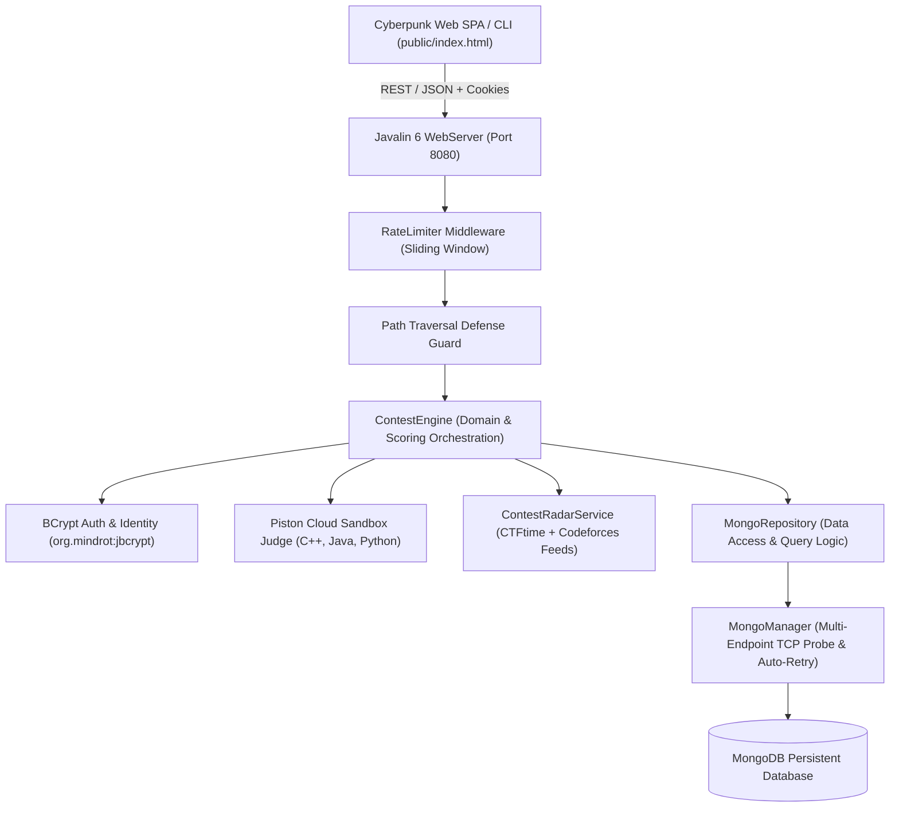

# ⚡ Cyber-Algo Arena

**Enterprise Multi-Contest Cyber & Competitive Programming Arena**  
*Combining picoCTF, CTFtime, and VJudge into a single unified full-stack competitive ecosystem.*

---

## 🏗️ 1. Architecture Overview



### Core Architecture Highlights
- **Persistent Storage**: Backed by MongoDB with synchronous official Java driver (`mongodb-driver-sync:5.3.1`) and multi-endpoint TCP auto-discovery (`mongodb:27017`, `localhost:27017`).
- **Cloud Code Judge**: Free zero-cost execution sandbox via Piston API (`POST https://emkc.org/api/v2/piston/execute`) supporting C++, Java, and Python with automated compilation and testcase matching.
- **Live Tournament Radar**: Automated aggregator for upcoming CTFtime and Codeforces events cached with 10-minute TTL and resilient offline fallbacks.
- **Security Hardening**:
  - **BCrypt Password Hashing**: Passwords stored as `$2a$12$` BCrypt digests.
  - **Timing-Attack Defense**: Flag and passkey comparisons utilize `java.security.MessageDigest.isEqual()`.
  - **Rate Limiting**: Sliding-window IP limiter (20 attempts/min on auth, 10/min on submit) with cooldown tracking.
  - **Path Traversal Protection**: Enforced canonical containment on challenge attachments (`./contest_data/attachments`).
  - **Headers**: Strict `Content-Security-Policy`, `X-Content-Type-Options: nosniff`, and `X-Frame-Options: DENY`.

---

## 🚀 2. One-Command Quickstart (Docker)

```bash
# Clone the repository
git clone https://github.com/0xSaadBinSultan/cyber-algo-arena.git
cd cyber-algo-arena

# Build and launch Arena & MongoDB in background
docker compose up --build -d
```

Open your browser at **`http://localhost:8080`**.

### Default Administrator Credentials
- **Username**: `admin`
- **Password**: `admin_password_123` *(also accepts `admin123` / `admin`)*

---

## 💻 3. Local Development & Testing

### Prerequisites
- **Java JDK 21+**
- **Maven** (or bundled `./mvnw`)
- **Docker** & **Docker Compose**

### Compile & Build
```bash
./mvnw clean package -B -DskipTests
```

### Run Lifecycle & Security Test Suite (45/45 Assertions)
```bash
java -cp target/cyber-algo-arena-1.0.0.jar App --demo
```

### Run Web Server Locally
```bash
export PORT=8080
export MONGODB_URI=mongodb://localhost:27017
export MONGODB_DATABASE_NAME=cyber_algo_arena
java -jar target/cyber-algo-arena-1.0.0.jar
```

### Automated Problem Importer
Populate real Div.2 / Div.3 Codeforces problem sets and standard CTF suites:
```bash
python3 scripts/import_problems.py
```

---

## 📡 4. REST API Documentation

| Method | Endpoint | Description | Auth Required |
|---|---|---|---|
| `POST` | `/api/auth/register` | Register a new operative account | No |
| `POST` | `/api/auth/login` | Authenticate and create HTTP session cookie | No (Rate Limited) |
| `POST` | `/api/auth/logout` | Invalidate active session cookie | Yes |
| `GET` | `/api/auth/me` | Fetch active user identity & statistics | Yes |
| `GET` | `/api/challenges` | List all active CTF & CP challenges | Yes |
| `GET` | `/api/challenges/{id}` | Get detailed challenge metadata & attachments | Yes |
| `POST` | `/api/hints/{challengeId}` | Unlock challenge hint (deducts points) | Yes |
| `POST` | `/api/submit` | Submit CTF flag or CP solution code | Yes (Rate Limited) |
| `GET` | `/api/teams/me` | Fetch active user's syndicate details | Yes |
| `POST` | `/api/teams/create` | Establish a new syndicate with secret passkey | Yes |
| `POST` | `/api/teams/join` | Join syndicate via name & secret passkey | Yes |
| `GET` | `/api/contests` | List active & upcoming arenas | Yes |
| `POST` | `/api/contests/register` | Register syndicate for specific contest | Yes |
| `GET` | `/api/events/upcoming` | Live Contest Radar (CTFtime + Codeforces) | No |
| `GET` | `/api/leaderboard` | Real-time contest standings & solve ranking | No |
| `GET` | `/api/admin/submissions` | Audit log of all submission attempts | Admin |
| `POST` | `/api/admin/challenges/ctf` | Deploy new CTF challenge | Admin |
| `POST` | `/api/admin/challenges/cp` | Deploy new CP problem | Admin |
| `DELETE` | `/api/admin/challenges/{id}` | Delete challenge and disk attachments | Admin |
| `POST` | `/api/admin/sync` | Force synchronize memory state to MongoDB | Admin |

---

## 📁 5. Repository Structure

```
cyber-algo-arena/
├── Dockerfile                  ← Multi-stage Alpine container build
├── docker-compose.yml          ← Orchestration for arena-web + mongo:latest
├── pom.xml                     ← Maven dependencies (Javalin, BCrypt, Mongo Sync Driver)
├── public/
│   └── index.html              ← Cyberpunk SPA with localStorage session persistence
├── scripts/
│   └── import_problems.py      ← Codeforces API problemset fetcher & CTF seeder
├── contest_data/
│   ├── attachments/            ← Downloadable challenge binaries & files
│   └── testcases/              ← CP problem testcase input/output suites
├── src/
│   ├── App.java                ← Entry point, dynamic PORT, shutdown hooks
│   ├── WebServer.java          ← REST controller, security headers, rate limiting
│   ├── ContestEngine.java      ← Core scoring, timing defense, submission evaluation
│   ├── ContestRadarService.java← CTFtime + Codeforces live feed aggregator
│   ├── PistonJudgeEngine.java  ← Cloud sandbox code judge engine
│   ├── MongoManager.java       ← TCP probing & persistent MongoDB connection pool
│   ├── MongoRepository.java    ← CRUD operations & schema mappings
│   ├── RateLimiter.java        ← Sliding-window request limiter
│   ├── User.java               ← Operative model with BCrypt verification
│   ├── Team.java               ← Syndicate model with constant-time join
│   ├── Challenge.java          ← Abstract challenge base
│   ├── CTFChallenge.java       ← Flag verification & hint economy
│   ├── CPProblem.java          ← Testcase diffing & resource limits
│   └── DemoRunner.java         ← 45-point automated lifecycle test suite
└── README.md
```

---

<p align="center"><strong>Cyber-Algo Arena</strong> — Elite hybrid battleground for hackers and algorithmic programmers.</p>
